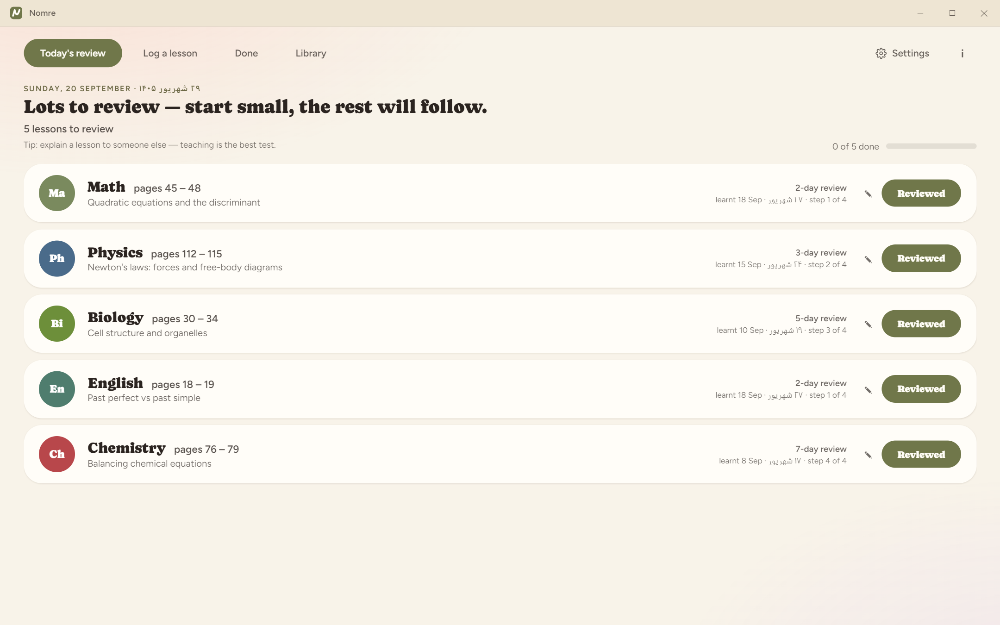
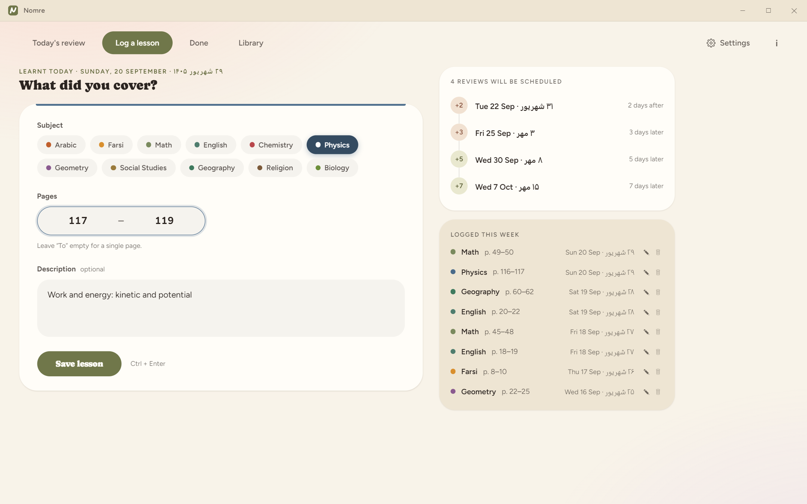
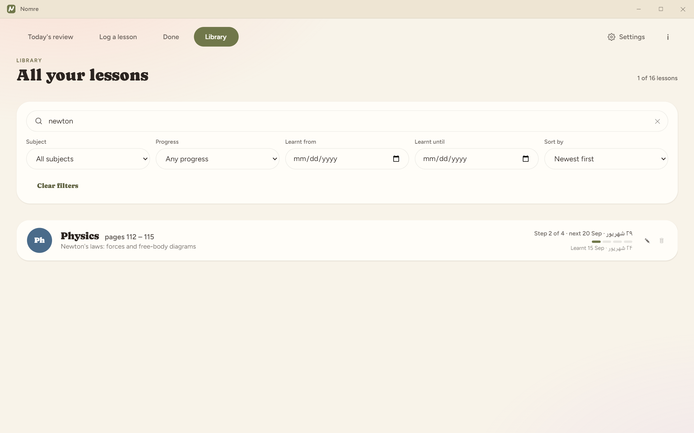
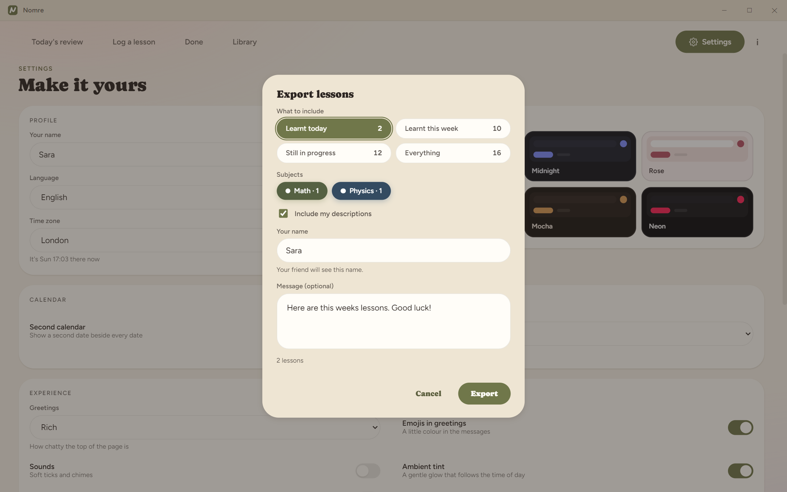
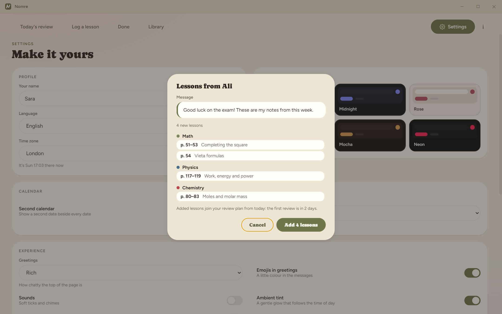
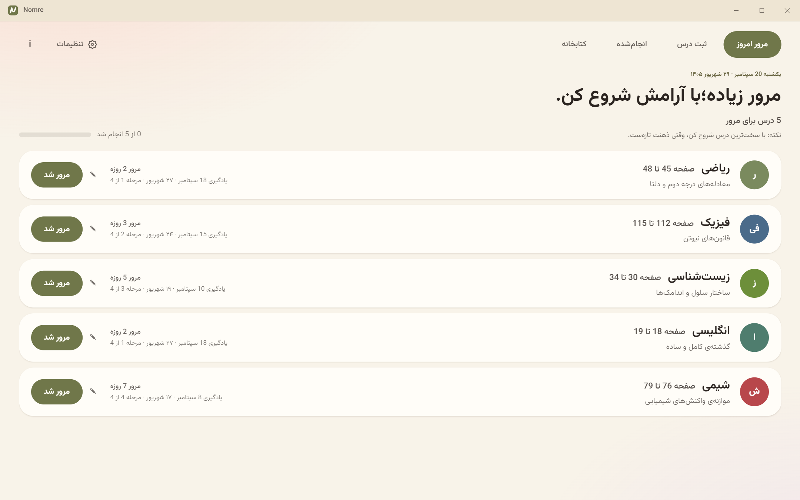
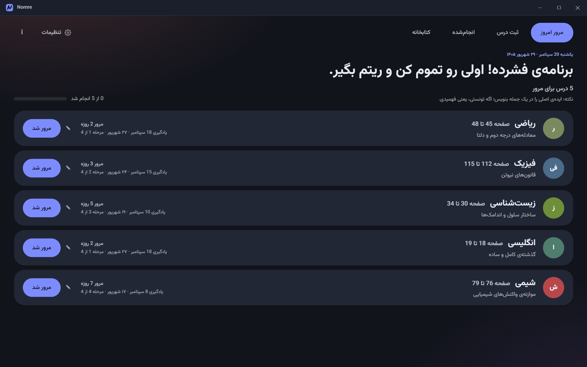
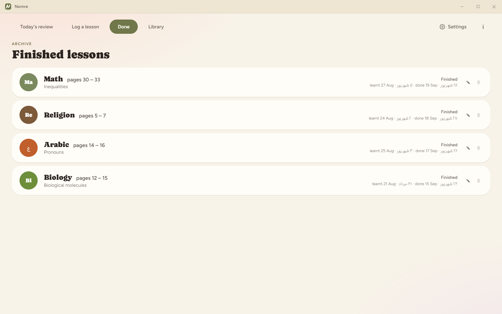
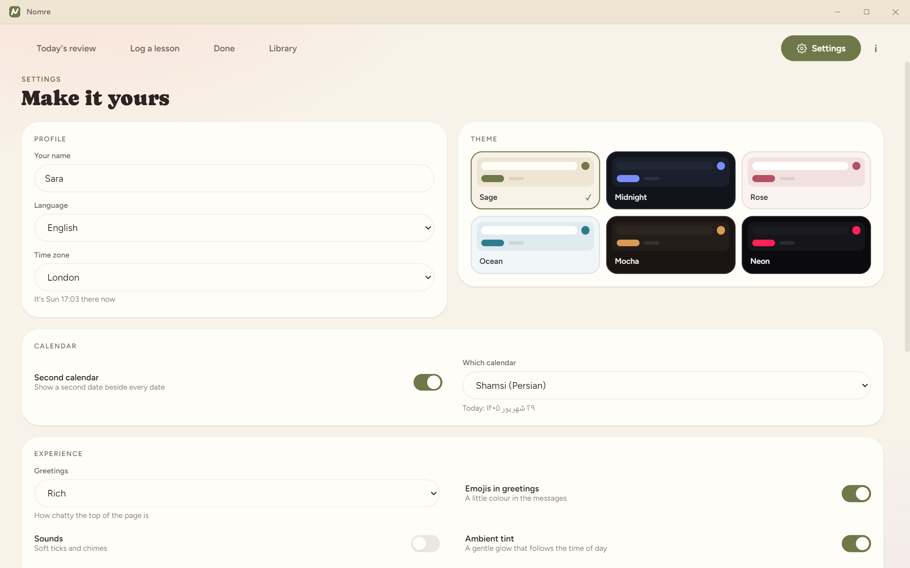
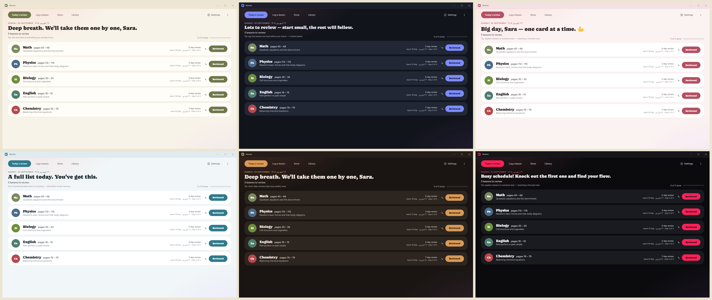

  

<h1 align="center">Nomre</h1>

<b>Remember what you learn.</b> A calm, simple spaced-review study tracker for Windows and Android. Free &middot; works offline &middot; no account &middot; Farsi + English

  <a href="https://github.com/piksami/Nomre-releases/releases"><b>Download for Windows</b></a> &nbsp;&middot;&nbsp; <a href="https://github.com/piksami/Nomre-releases/releases"><b>Download for Android</b></a>

**Status: beta** - made by Sam Ashoori.

---

## How it works

Log what you learnt today. Nomre tells you what to review each day using the **2-3-5-7 method**: review a lesson **2 days** after you learn it, then **3**, **5** and **7 days** after each previous review. Tap **Reviewed**, and the next review is scheduled for you. After four reviews the lesson moves to **Done**.

## Features

- **Today's review**: only what is due, with a progress bar and a friendly note when you are done.
- **Log a lesson in seconds**: pick the subject, type the pages (a single page needs only one box), add an optional description, and see your review plan right away.
- **Library**: search and filter everything you have learnt by subject, page, date, progress or description.
- **Share lessons with friends**: export a small file (choose today, this week, in progress or everything, pick subjects, add your name and a message). Your friend drags the file onto Nomre, sees exactly what is in it, and chooses whether to add it. Duplicates are skipped and missing subjects are created for them.
- **Six themes**: Sage, Midnight, Rose, Ocean, Mocha and Neon.
- **Farsi and English** with full right-to-left support, plus an optional **second calendar** (Persian, Islamic, Hebrew, Chinese, Buddhist, Japanese, Indian, Coptic, Ethiopic and more).
- **Your own subjects**, with your own colours.
- **Keyboard friendly**: 1-5 switch tabs, N starts a new lesson, R marks the next review done, / or Ctrl+F searches, Ctrl+Enter saves.
- **On your phone too**: the same app for Android, with a layout made for a phone. Move lessons between your computer and phone with Export and Import.
- **Private by design**: everything stays on your device. No account, nothing is sent anywhere.
- **Easy updates**: Settings > Updates > Check for updates, on Windows and on Android. Your lessons are kept.

## Screenshots

<table>
  <tr>
    <td width="50%"> <b>Log a lesson</b>: subject, pages, notes, and your review plan.</td>
    <td width="50%"> <b>Library</b>: find anything you have learnt.</td>
  </tr>
  <tr>
    <td width="50%"> <b>Export</b>: choose what to send to a friend.</td>
    <td width="50%"> <b>Import</b>: see the sender, the message and every lesson before adding.</td>
  </tr>
  <tr>
    <td width="50%"> <b>Farsi</b>, right-to-left, with a Persian calendar beside every date.</td>
    <td width="50%"> <b>Midnight</b> theme.</td>
  </tr>
  <tr>
    <td width="50%"> <b>Done</b>: lessons that finished all four reviews.</td>
    <td width="50%"> <b>Settings</b>: make it yours.</td>
  </tr>
</table>

 Six themes: Sage, Midnight, Rose, Ocean, Mocha, Neon.

---

## Download

Go to the **[Releases page](https://github.com/piksami/Nomre-releases/releases)** and open the newest release. It has both downloads:

- **Windows:** `Nomre-Setup-x.y.z-beta.exe`
- **Android:** `Nomre-x.y.z-beta.apk`

## Install on Windows

1. Run the downloaded installer. It installs for your user only - no administrator rights needed.
2. Windows may show a blue *"Windows protected your PC"* / *unknown publisher* screen, because the app is not code-signed yet. Click **More info**, then **Run anyway**.
3. Open **Nomre** from the desktop or Start menu.

## Install on Android

Android 8.0 or newer.

1. On your phone, open the **Releases page** and download **Nomre-x.y.z-beta.apk** from the newest release.
2. Open the downloaded file and tap **Install**. Android may ask you to allow installing apps from your browser or file manager first, because Nomre is not on Google Play yet. Allow it for this one install.
3. Open **Nomre**.

## Updates

**Windows:** Nomre updates itself. Open **Settings > Updates > Check for updates**. Your lessons are kept when you update.

**Android:** open **Settings > Updates > Check for updates**. If there is a newer version, tap **Download and update**, open the downloaded file and tap **Install**. It installs over the old one and your lessons are kept. (You can also just download the newest APK from the Releases page and install it the same way.)

## Moving lessons between your computer and phone

On one device, open **Settings > Share lessons > Export lessons**, turn on **Include my review progress**, and send yourself the file. On the other device, choose **Import a file**.

## Your data

Everything is stored only on your device (on Windows, in `%APPDATA%\nomre`). There is no account and nothing is sent anywhere. Uninstalling the Windows app keeps your lessons; uninstalling the Android app removes them, so export a file first if you want a copy.

